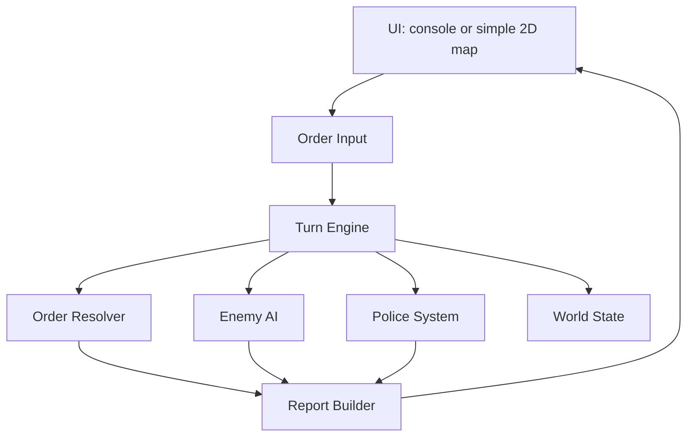
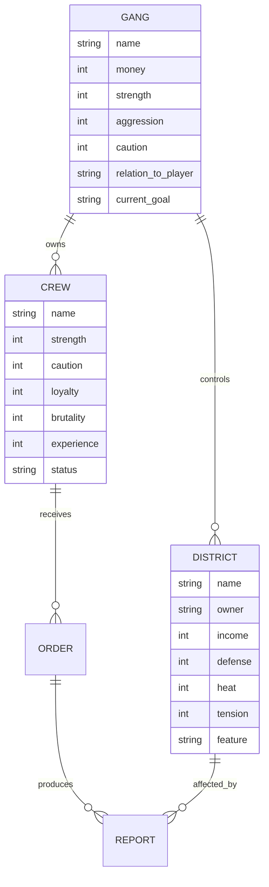

# Architecture: Project District

Архитектура версии 0.1 должна быть простой: локальный пошаговый движок, фиксированная конфигурация мира, отдельный расчет приказов и генератор отчетов. Главная цель - быстро менять правила и тексты, не строя большой фреймворк до проверки ядра.

## System Overview

### Architecture Style

Локальный монолит для прототипа. Можно реализовать как консольное приложение или маленькое 2D-приложение, но доменная логика не должна зависеть от UI.

### Component Diagram



## Component Descriptions

| Component | Responsibility | Technology | Dependencies |
|-----------|----------------|------------|--------------|
| World State | Хранит районы, банды, бригады, день и историю | In-memory data structures | Fixed config |
| Order Input | Проверяет доступность приказов и целей | UI layer | World State |
| Turn Engine | Оркестрирует фазы дня | Plain application logic | Resolver, Enemy AI, Police |
| Order Resolver | Считает успех, риск, самовольство и эффекты | Weighted rules + RNG | World State |
| Enemy AI | Выбирает действия врагов по простым правилам | Rule-based logic | World State |
| Police System | Обрабатывает рост жары, рейды и последствия | Rule-based logic | World State |
| Report Builder | Превращает события в читаемые отчеты | Templates | Event log |

## Technology Stack

| Layer | Technology | Version | Rationale |
|-------|------------|---------|-----------|
| Core logic | Любой быстрый локальный язык | TBD | Важна скорость прототипирования |
| UI MVP | Console | 0.1 | Самый быстрый способ проверить ядро |
| UI Could | Simple 2D | После консоли | Улучшает читаемость карты |
| Storage | In-memory, optional JSON save | 0.1 optional | Сохранения не критичны для первого теста |

## Architecture Decision Records

| ADR | Title | Status | Key Choice |
|-----|-------|--------|------------|
| [[игра/Project District/architecture/ADR-001-turn-engine|ADR-001]] | Пошаговый локальный движок | Accepted | Один день считается пакетно |
| [[игра/Project District/architecture/ADR-002-fixed-data-model|ADR-002]] | Фиксированная модель данных 0.1 | Accepted | 4 района, 3 банды, 2 бригады |
| [[игра/Project District/architecture/ADR-003-qualitative-risk|ADR-003]] | Качественная оценка риска | Accepted | Без точных процентов в UI |
| [[игра/Project District/architecture/ADR-004-report-first-ui|ADR-004]] | Отчеты как главный интерфейс | Accepted | Каждый эффект объясняется текстом |
| [[игра/Project District/architecture/ADR-005-readable-ai|ADR-005]] | Понятный rule-based ИИ | Accepted | ИИ объясняет мотивацию |

## Data Architecture



## State Machine

### Day Lifecycle

```text
Morning Summary
  -> Planning
  -> Resolve Player Orders
  -> Resolve Enemy Actions
  -> Resolve Police Reaction
  -> Evening Report
  -> Check Win/Loss
  -> Next Day
```

| From State | Event | To State | Side Effects | Error Handling |
|------------|-------|----------|--------------|----------------|
| Planning | confirm_orders | Resolve Player Orders | Orders locked | Invalid orders are rejected before confirmation |
| Resolve Player Orders | all_resolved | Resolve Enemy Actions | Event log updated | Failed resolver emits explicit error report |
| Evening Report | continue | Check Win/Loss | Report archived | Missing report blocks next day |

### Crew Lifecycle

```text
free -> busy -> free
free -> wounded -> free
free -> lying_low -> free
free -> arrested
free -> missing
```

## Configuration Model

| Field | Type | Default | Constraint | Description |
|-------|------|---------|------------|-------------|
| districts | list | 4 records | exactly 4 for 0.1 | Стартовые районы |
| gangs | list | 3 records | includes player | Стартовые банды |
| crews | list | 2 records | player only | Бригады игрока |
| order_noise | map | per order | 0..5 | Шумность приказов |
| heat_max | int | 10 | > 0 | Порог большой облавы |
| victory_days | int | 5 | > 0 | Сколько дней удерживать 3 района |

## Error Handling

| Category | Severity | Retry | Example |
|----------|----------|-------|---------|
| Invalid Input | Medium | No | Цель не соседняя |
| Impossible Order | Medium | No | Бригада арестована |
| Resolver Bug | High | No | Неизвестный тип приказа |
| Missing Template | Low | Yes | Нет текста для частичного успеха |

## Observability

| Metric Name | Type | Description |
|-------------|------|-------------|
| turn_number | gauge | Текущий день |
| orders_resolved_total | counter | Сколько приказов рассчитано |
| catastrophes_total | counter | Сколько катастроф случилось |
| district_heat | gauge | Жара полиции по районам |
| player_district_count | gauge | Количество районов игрока |

## References

- Derived from: [[игра/Project District/requirements/_index|Requirements]]
- Next: [[игра/Project District/epics/_index|Epics]]
