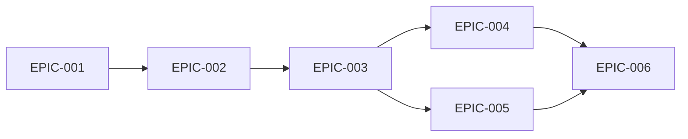

# Epics & Stories: Project District

Эпики разбивают вертикальный срез на исполнение от самого маленького закрытого цикла к читаемому прототипу. MVP считается готовым, когда можно сыграть 20 дней на 4 районах с отчетами и условиями победы/поражения.

## Epic Overview

| Epic ID | Title | Priority | MVP | Stories | Est. Size |
|---------|-------|----------|-----|---------|-----------|
| [[игра/Project District/epics/EPIC-001-core-loop|EPIC-001]] | Базовый дневной цикл | Must | Yes | 3 | M |
| [[игра/Project District/epics/EPIC-002-map-and-state|EPIC-002]] | Карта и состояние мира | Must | Yes | 3 | M |
| [[игра/Project District/epics/EPIC-003-orders-and-resolution|EPIC-003]] | Приказы и расчет исходов | Must | Yes | 4 | L |
| [[игра/Project District/epics/EPIC-004-reports-and-feedback|EPIC-004]] | Отчеты и обратная связь | Must | Yes | 3 | M |
| [[игра/Project District/epics/EPIC-005-ai-police-winloss|EPIC-005]] | Враги, полиция, победа и поражение | Must | Yes | 4 | L |
| [[игра/Project District/epics/EPIC-006-balance-and-playtest|EPIC-006]] | Баланс и плейтест | Should | No | 3 | M |

## Dependency Map

## Recommended Execution Order

1. [[игра/Project District/epics/EPIC-001-core-loop|EPIC-001]]: сначала нужен скелет дня.
2. [[игра/Project District/epics/EPIC-002-map-and-state|EPIC-002]]: затем фиксированное состояние мира.
3. [[игра/Project District/epics/EPIC-003-orders-and-resolution|EPIC-003]]: после этого появляется игра.
4. [[игра/Project District/epics/EPIC-004-reports-and-feedback|EPIC-004]]: потом игра становится понятной.
5. [[игра/Project District/epics/EPIC-005-ai-police-winloss|EPIC-005]]: затем мир начинает отвечать.
6. [[игра/Project District/epics/EPIC-006-balance-and-playtest|EPIC-006]]: только после полного цикла стоит балансировать.

## MVP Definition of Done

- [ ] Можно сыграть 20 дней.
- [ ] Есть 4 района, 2 бригады игрока и 2 вражеские банды.
- [ ] Все 5 приказов работают.
- [ ] Каждый приказ дает один из пяти исходов.
- [ ] Отчеты объясняют последствия.
- [ ] Есть победа и поражение.

## Traceability Matrix

| Requirement | Epic | Stories | Architecture |
|-------------|------|---------|--------------|
| REQ-001 | EPIC-001 | STORY-001-001..003 | ADR-001 |
| REQ-002 | EPIC-002 | STORY-002-001..003 | ADR-002 |
| REQ-003, REQ-004 | EPIC-003 | STORY-003-001..004 | ADR-001, ADR-003 |
| REQ-005, REQ-009 | EPIC-004 | STORY-004-001..003 | ADR-004 |
| REQ-006, REQ-007 | EPIC-005 | STORY-005-001..004 | ADR-005 |
| REQ-008 | EPIC-006 | STORY-006-001..003 | ADR-002 |

## Risks & Considerations

| Risk | Affected Epics | Mitigation |
|------|----------------|------------|
| Расчет исходов станет непрозрачным | EPIC-003, EPIC-004 | Каждый исход обязан иметь cause в отчете |
| Игрок будет делать один оптимальный приказ | EPIC-003, EPIC-006 | Проверять цену каждого действия |
| ИИ будет казаться случайным | EPIC-005 | Всегда писать мотивацию действия |

## References

- Derived from: [[игра/Project District/requirements/_index|Requirements]], [[игра/Project District/architecture/_index|Architecture]]
- Handoff to: [[игра/Project District/roadmap/roadmap|Roadmap]]
