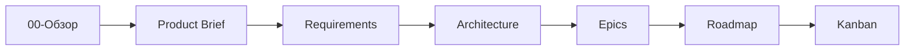
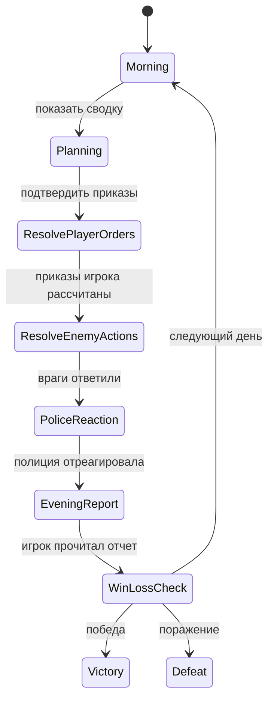
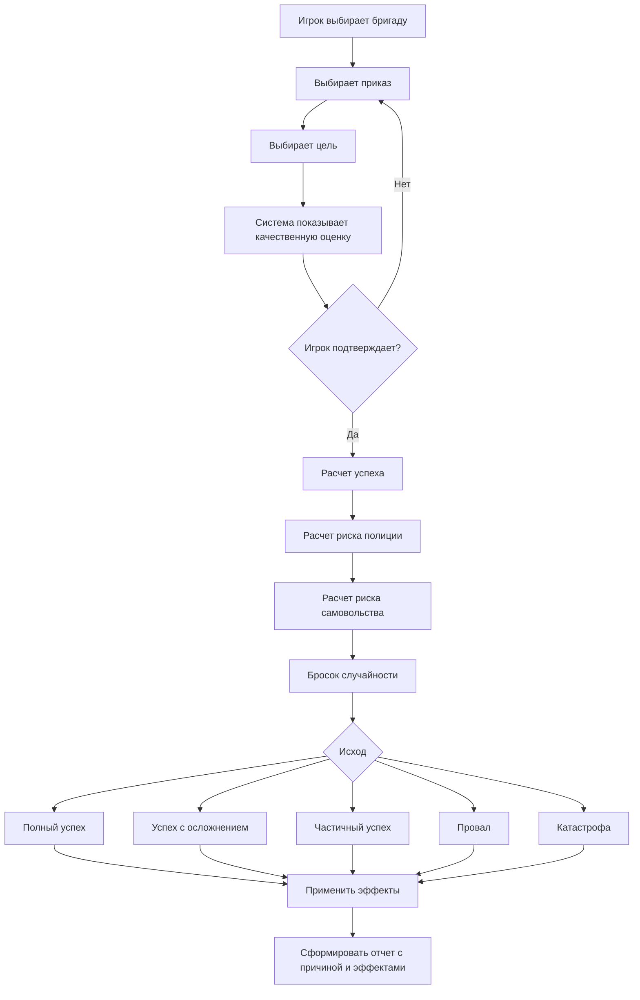
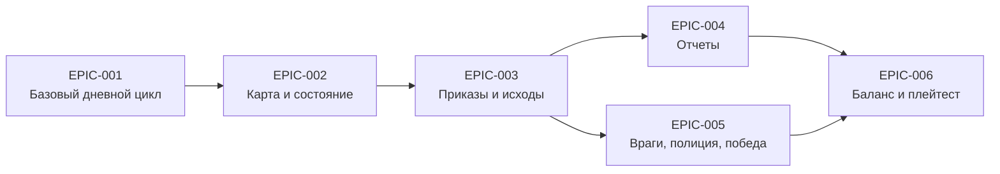
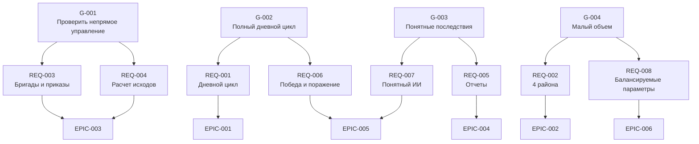
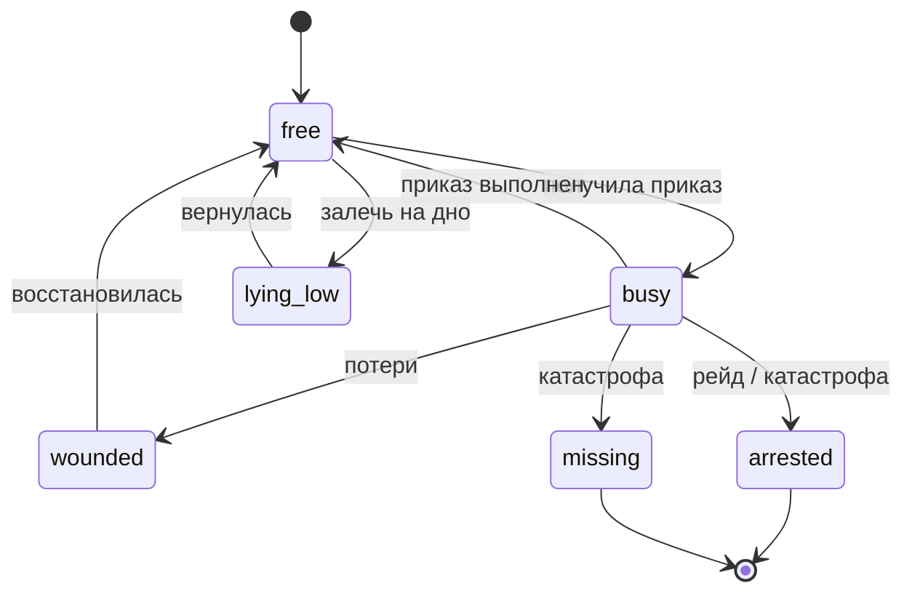
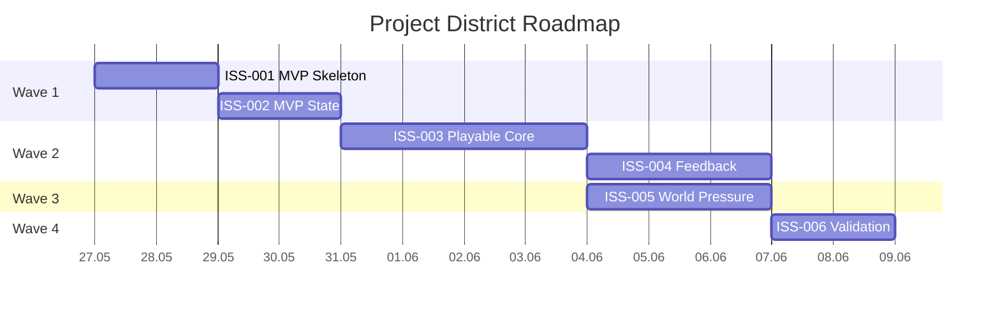

# Visualizations: Project District

## Документная цепочка

## Цикл игрового дня

## Поток расчета приказа

## Зависимости эпиков

## Трассировка от целей к реализации

## Состояния бригады

## Волны roadmap

